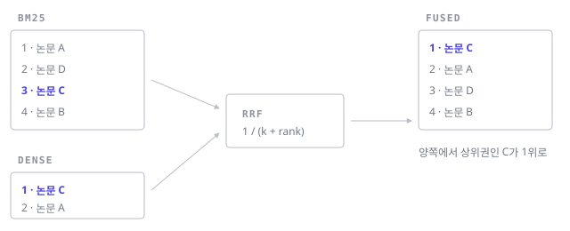

렉시컬 검색과 벡터 검색을 같이 쓰기로 했다면, 곧바로 마주치는 질문은 하나입니다.
**두 개의 순위 목록을 어떻게 하나로 합칠 것인가.**

## 가중합이 잘 안 되는 이유

가장 먼저 떠오르는 방법은 점수를 정규화해서 더하는 것입니다.

$$
s(q, d) = \alpha \cdot \tilde{s}_{\text{bm25}}(q, d) + (1 - \alpha) \cdot \tilde{s}_{\text{dense}}(q, d)
$$

문제는 두 점수의 성질이 완전히 다르다는 데 있습니다.

| | BM25 | Dense (cosine) |
|---|---|---|
| 범위 | 상한 없음 | `[-1, 1]` |
| 분포 | 쿼리마다 크게 달라짐 | 비교적 안정적 |
| 0의 의미 | 매칭 term 없음 | 무관함 |

BM25 점수는 쿼리 길이와 코퍼스의 IDF 분포에 따라 요동칩니다. 한 쿼리에서 최고점이
12점이고 다른 쿼리에서는 40점이면, min-max 정규화를 해도 `α`가 쿼리마다 사실상
다른 의미를 갖게 됩니다. 오프라인에서 튜닝한 `α`가 프로덕션에서 무너지는
전형적인 경로입니다.

## RRF: 점수를 버리고 순위만 쓴다

Reciprocal Rank Fusion은 점수를 아예 보지 않습니다. 순위만 씁니다.

$$
\text{RRF}(d) = \sum_{r \in R} \frac{1}{k + \text{rank}_r(d)}
$$

```python title="rrf.py"
from collections import defaultdict

def rrf(rankings: list[list[str]], k: int = 60) -> list[tuple[str, float]]:
    """rankings: 각 검색기가 반환한 doc_id 목록 (상위부터 정렬됨)."""
    scores = defaultdict(float)
    for ranking in rankings:
        for rank, doc_id in enumerate(ranking, start=1):
            scores[doc_id] += 1.0 / (k + rank)
    return sorted(scores.items(), key=lambda kv: -kv[1])
```



`k = 60`은 원 논문의 값이고, 대체로 잘 동작합니다. `k`를 키우면 상위권과 하위권의
점수 차가 완만해져서 여러 검색기의 의견이 더 고르게 반영됩니다.

> 점수를 버리는 건 정보를 버리는 것이기도 합니다.
 한쪽 검색기가 "이건 확실하다"고
> 말하는 신호가 사라집니다. 대신 튜닝할 게 `k` 하나뿐이라 무너지지 않습니다.

## 실제로는 어디서 갈리나


우리 쪽 학술 검색 로그로 비교해 봤을 때 패턴이 갈리는 지점은 명확했습니다.

- **정확한 용어 쿼리** (저자명, 학회 약어, 고유 용어) — BM25 단독이 가장 낫고,
  dense를 섞으면 오히려 떨어집니다.
- **서술형 쿼리** ("전이학습을 교육 데이터에 적용한 연구") — dense가 크게 앞섭니다.
- **혼합형** — RRF가 두 단독 검색기 모두를 이깁니다.

그래서 실무적인 결론은 "무조건 합치기"가 아니라, **쿼리 유형을 먼저 나누고 그에
따라 융합 여부를 정하는 것**에 가까웠습니다. 쿼리 분류기는 생각보다 간단한
피처(길이, 따옴표 유무, 숫자·대문자 비율)만으로도 쓸 만하게 동작합니다.

## 정리

1. 점수 가중합은 스케일 문제 때문에 쿼리 간 일반화가 잘 안 된다.
2. RRF는 순위만 써서 그 문제를 우회하고, 튜닝 파라미터가 하나뿐이다.
3. 다만 융합이 항상 이득은 아니다 — 쿼리 유형에 따라 켜고 끄는 게 낫다.
