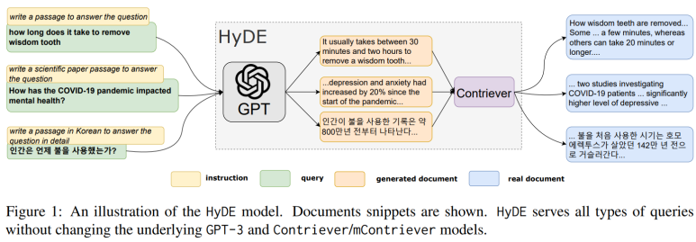
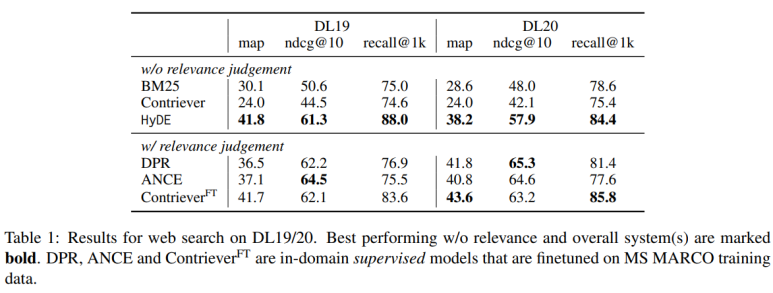
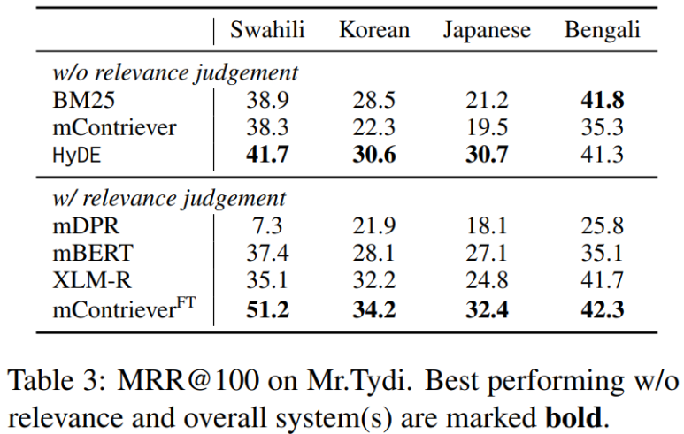
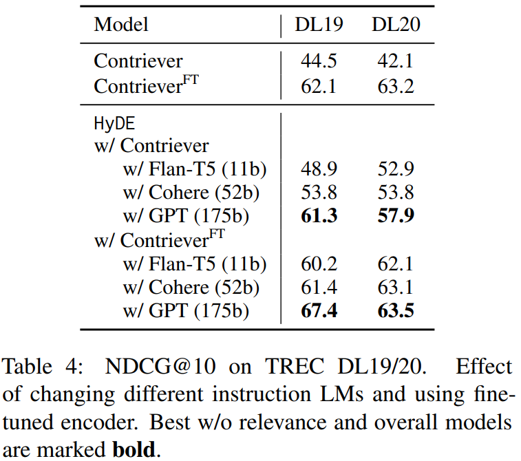

이번에 리뷰할 논문은 ACL 2023에 발표한 Precise Zero-Shot Dense Retrieval without Relevance Labels 입니다.

해당 논문은 relevance label 없이도 dense retrieval의 정확도를 높이기 위해 Hypothetical Document Embeddings(HyDE)를 제안했습니다. Query를 그대로 embedding하지 않고, instruction-following LLM이 먼저 가상의 관련 문서를 생성한 뒤 Contriever가 그 문서를 embedding하는 방식입니다.

HyDE는 retrieval 문제를 query-document relevance 학습 하나로 처리하는 것이 아니라, LLM을 통해 query와 관련된 문서의 형태를 생성하고, contrastive encoder는 생성된 문서를 실제 corpus의 document embedding space에 연결합니다. 저자들은 이러한 분해만으로 별도의 retriever 학습이나 fine-tuning 없이 BM25와 unsupervised Contriever를 크게 앞서며, 일부 설정에서는 relevance label로 학습한 retriever와 비슷한 성능을 얻었다고 보고합니다.

## 등장 배경

Dense retrieval은 query와 document를 각각 dense vector로 변환한 뒤, 두 vector의 similarity가 높은 문서를 찾는 방식입니다. BM25가 단어의 정확한 일치와 빈도에 크게 의존하는 반면, dense retrieval은 표현이 달라도 의미가 비슷한 문서를 찾을 수 있습니다. 따라서 web search, open-domain question answering, fact verification처럼 query와 정답 문서의 표현이 자주 달라지는 작업에 적합합니다.

일반적인 dense retriever는 query encoder와 document encoder가 만든 vector의 inner product가 relevance를 나타내도록 학습합니다. 이때 어떤 query와 document가 관련 있는지 알려 주는 positive pair와, 관련이 없는 negative pair가 필요합니다. Hard negative mining, knowledge distillation, retrieval-specific pre-training 같은 기법도 결국 이 relevance signal을 더 효과적으로 학습하는 방향에 가깝습니다.

문제는 새로운 domain이나 language에 relevance judgment가 없을 때 발생합니다. 당시 zero-shot dense retrieval 연구의 다수는 MS MARCO처럼 대규모 relevance label이 있는 dataset으로 retriever를 학습한 다음, BEIR의 새로운 task로 이전하는 transfer learning 설정을 사용했습니다. 그러나 대상 task에 label이 없을 뿐, retriever 자체는 대규모 supervised data에 의존합니다.

이 논문이 다루는 fully zero-shot 설정은 더 엄격합니다. 학습 시점에 평가 query set, 평가 corpus, relevance judgment를 모두 사용하지 않으며, MS MARCO 같은 별도의 retrieval supervision도 가정하지 않습니다. 

논문은 이 설정을 넓은 의미에서 unsupervised라고 부르지만, instruction-following LLM이 instruction data와 human feedback으로 학습되었다는 점까지 없어진 것은 아닙니다.

Relevance label 없이 query encoder와 document encoder를 같은 공간에 정렬하는 작업이 어려운 이유는 두 가지입니다. 첫째, 짧은 query와 긴 document는 문체와 정보량이 달라 단순한 semantic similarity만으로 relevance를 표현하기 어렵습니다. 둘째, relevance는 task에 따라 달라집니다. 같은 passage도 question answering에서는 정답을 포함해야 하고, argument retrieval에서는 반론을 제공해야 하며, fact verification에서는 claim을 지지하거나 반박해야 합니다.

반면 self-supervised contrastive learning으로 학습한 document encoder는 document-document similarity를 비교적 안정적으로 표현할 수 있습니다. Instruction-following LLM은 별도의 task-specific fine-tuning 없이도 “질문에 답하는 passage를 작성하라”, “주장에 대한 반론을 작성하라”와 같은 새로운 instruction을 수행할 수 있습니다. HyDE는 이 두 능력을 연결해 query-document relevance를 직접 학습해야 하는 문제를 우회합니다. 

## HyDE

위 그림은 HyDE의 전체 구조를 보여줍니다. 왼쪽의 instruction과 query가 GPT-3 계열의 InstructGPT로 들어가면 가운데의 hypothetical document가 생성됩니다. 생성된 문서는 Contriever 또는 mContriever로 embedding되며, 마지막에는 같은 embedding space에 미리 저장된 실제 문서 중 가까운 문서를 반환합니다.

그림에는 세 가지 예시가 제시됩니다. 사랑니 제거 시간에 관한 web query에는 답변 passage를, COVID-19가 정신 건강에 미친 영향에는 scientific passage를, 인간이 언제 불을 사용했는지 묻는 한국어 query에는 한국어 passage를 생성합니다. Hypothetical document의 세부 사실이 정확하지 않더라도, 실제 관련 문서가 사용할 법한 용어와 서술 구조를 만들어 retrieval 방향을 설정하는 것이 목적입니다.

### Hypothetical document 생성

첫 번째 단계에서 instruction-following LLM은 query에 직접 답하는 문서를 생성합니다. 일반적인 query expansion이 keyword나 짧은 phrase를 추가하는 것과 달리, HyDE는 완성된 passage 형태의 example을 만듭니다. Query가 “how long does it take to remove wisdom tooth”라면, 관련 문서에서 등장할 법한 “minutes”, “hours”, “procedure” 같은 표현과 답변 문체가 함께 생성됩니다.

이 문서는 실제 corpus에서 가져온 문서가 아니므로 factual error를 포함할 수 있습니다. 논문은 이를 실패로 간주하지 않습니다. 생성 단계의 목적은 사실을 최종 답변으로 전달하는 것이 아니라, 해당 query와 관련된 문서의 relevance pattern을 만드는 것이기 때문입니다. 즉 LLM에는 정확한 검색 결과를 생성하는 역할이 아니라 검색해야 할 문서의 예시를 생성하는 역할을 부여합니다.

Task별 instruction은 다음과 같이 달라집니다.

- Web Search / DBPedia-Entity
  - Please write a passage to answer the question
- SciFact
  - Please write a scientific paper passage to support/refute the claim
- ArguAna
  - Please write a counter argument for the passage
- TREC-COVID
  - Please write a scientific paper passage to answer the question
- FiQA
  - Please write a financial article passage to answer the question
- TREC-NEWS
  - Please write a news passage about the topic
- Mr.TyDi
  - Please write a passage in Swahili/Korean/Japanese/Bengali to answer the question in detail

위 instruction은 query의 topic뿐 아니라 원하는 관련 문서의 역할과 genre를 지정합니다. SciFact에서는 scientific evidence, ArguAna에서는 counter argument, FiQA에서는 financial article이 필요하다는 차이를 prompt에 반영합니다. 동일한 GPT-3와 Contriever를 유지하면서도 task마다 다른 relevance를 표현할 수 있는 이유가 이 instruction에 있습니다.

### Document-only embedding space

두 번째 단계에서는 generated document를 unsupervised contrastive encoder인 Contriever에 입력합니다. Corpus의 실제 document도 같은 encoder로 미리 embedding해 둡니다. 따라서 검색 시 비교되는 것은 짧은 query와 document가 아니라, hypothetical document와 real document입니다.

이 변환은 modality mismatch를 줄입니다. Query는 보통 짧고 의문문 형태이며, document는 길고 서술문 형태입니다. LLM이 query를 document 형태로 바꾸면 두 입력의 길이, 문체, 정보 구조가 가까워지므로 document-document similarity를 학습한 encoder를 그대로 활용할 수 있습니다.

논문은 Contriever의 dense bottleneck을 lossy compressor로 해석합니다. Generated document에 잘못된 연도나 수치가 포함되더라도, 제한된 차원의 dense vector에는 모든 token-level detail이 보존되지 않으며 주제와 의미에 가까운 정보가 주로 남기 때문입니다. 이후 실제 corpus embedding과의 nearest-neighbor search가 hypothetical document를 실제 문서에 grounding합니다.

다만 “hallucinated detail이 dense bottleneck에서 걸러진다”는 설명은 논문의 설계 가설에 가깝습니다. 실험은 최종 retrieval score가 높아진다는 사실을 보여주지만, 어떤 factual error가 embedding에서 제거되었는지 직접 측정하지는 않습니다. 따라서 hallucination이 항상 무해하다고 해석하기보다, 오류가 있어도 전체 relevance pattern이 유효하면 retrieval이 동작할 수 있다는 주장으로 이해하는 편이 정확합니다.

수학적 구성

일반적인 dense retrieval은 query encoder와 document encoder가 만든 두 vector의 inner product를 similarity로 사용합니다.
$$
\text{sim}(q, d) = <\text{enc}_q(q), \text{enc}_d(d)> = <v_q, v_d>
$$

위 수식에서 query $q$는 query vector로, document $d$는 document vector로 변환됩니다. 이 때, 문제는 relevance label 없이 서로 다른 두 encoder가 만든 vector를 같은 공간에 배치하고, 그 inner product가 relevance를 나타내도록 만드는 것이 어렵다는 점입니다.

HyDE는 document encoder를 unsupervised contrastive encoder로 고정하고 이를 함수 f로 정의합니다.
$$
f = \operatorname{enc}_d = \operatorname{enc}_{\mathrm{con}}
$$

모든 corpus의 document는 동일한 f로 embedding됩니다.

$$\mathbf{v}_d = f(d)
\quad
\forall d \in D_1 \cup D_2 \cup \cdots \cup D_L$$

이 단계는 query와 무관하게 offline으로 수행할 수 있습니다. 생성된 document vector를 이용한 실제 검색에는 standard MIPS(Maximum Inner Product Search) index를 그대로 사용할 수 있으므로, generative retrieval처럼 별도의 neural index나 constrained decoding을 설계할 필요가 없습니다.

다음으로 instruction-following LM을 query와 instruction을 입력받는 함수 g로 정의합니다.

$$g(q, \mathrm{INST}) = \operatorname{InstructLM}(q, \mathrm{INST})$$

함수 g가 만든 hypothetical document를 f에 통과시키면 query를 대신할 document-shaped vector가 만들어집니다. 논문은 생성 분포에서 얻는 vector의 expectation을 query representation으로 정의합니다.

$$\mathbb{E}[\mathbf{v}_{q_{ij}}]
=
\mathbb{E}\left[f\left(g(q_{ij}, \mathrm{INST}_i)\right)\right]$$

실제 계산에서는 LLM으로 hypothetical document를 N개 sampling하고, 각 document embedding의 평균을 사용해 expectation을 근사합니다.

$$\hat{\mathbf{v}}_{q_{ij}}
=\frac{1}{N}
\sum_{\hat{d}_k \sim g(q_{ij}, \mathrm{INST}_i)}
f(d_k)=
\frac{1}{N}
\sum_{k=1}^{N}
f(\hat{d}_k)$$
여러 sample을 평균내는 이유는 한 번의 생성에 포함된 우연한 표현이나 잘못된 세부 정보의 영향을 줄이기 위해서입니다.

마지막 변형에서는 원래 query 자체도 하나의 hypothesis로 포함합니다.

$$\hat{\mathbf{v}}_{q_{ij}}
=
\frac{1}{N+1}
\left[
\sum_{k=1}^{N} f(\hat{d}_k)
+
f(q_{ij})
\right]$$
이 방식은 N개의 generated document embedding과 원 query embedding을 함께 평균합니다. 생성 문서가 relevance pattern과 풍부한 표현을 제공하는 동안, 원 query는 생성 과정에서 빠질 수 있는 핵심 lexical cue를 보존하는 역할을 할 수 있습니다.

### Training-free 결합

HyDE를 구성하기 위해 새 모델을 학습하지 않는다는 점도 중요한 설계입니다. InstructGPT와 Contriever는 각각 기존 상태 그대로 사용하며, HyDE를 위해 gradient update나 retrieval fine-tuning을 수행하지 않습니다. Corpus만 Contriever로 encoding하고, query마다 LLM generation과 embedding을 수행하면 됩니다.

## 실험 설정

저자들은 generative model로 175B parameter 규모의 text-davinci-003 InstructGPT를 사용하고, open-ended generation의 temperature를 0.7로 설정했습니다. 영어 task에는 English Contriever, 비영어 task에는 multilingual mContriever를 사용했습니다. Retrieval pipeline은 sparse retrieval과 dense retrieval을 모두 지원하는 Pyserini로 구현했습니다.

평가 dataset은 세 그룹으로 구성됩니다. Web search에는 MS MARCO corpus 기반의 TREC DL19와 DL20을 사용했습니다. Low-resource retrieval에는 BEIR의 SciFact, ArguAna, TREC-COVID, FiQA, DBPedia, TREC-NEWS를 사용했고, multilingual retrieval에는 Mr.TyDi의 Swahili, Korean, Japanese, Bengali를 사용했습니다.

Relevance judgment를 사용하지 않는 baseline은 lexical retriever인 BM25와 unsupervised contrastive retriever인 Contriever 또는 mContriever입니다. Relevance data를 사용하는 reference system으로는 DPR, ANCE, ContrieverFT, mDPR, mBERT, XLM-R, mContrieverFT를 포함했습니다. 특히 ContrieverFT와 mContrieverFT는 retrieval-specific pre-training과 MS MARCO fine-tuning을 거친 강한 supervised upper bound에 해당합니다.

평가 지표도 task에 맞게 구분됩니다. TREC DL19와 DL20은 MAP, nDCG@10, Recall@1k를 사용합니다. BEIR의 여섯 task는 nDCG@10과 Recall@100을 사용하며, Mr.TyDi는 MRR@100을 사용합니다. 따라서 서로 다른 표의 숫자를 직접 비교하기보다, 같은 dataset과 같은 metric 안에서 system 간 차이를 봐야 합니다.

## 실험 결과
### Web search

TREC DL19에서 HyDE는 MAP 41.8, nDCG@10 61.3, Recall@1k 88.0을 기록했습니다. Contriever의 24.0, 44.5, 74.6과 비교하면 각각 17.8점, 16.8점, 13.4점 높습니다. BM25의 30.1, 50.6, 75.0도 모든 지표에서 앞섭니다.

TREC DL20에서도 HyDE는 MAP 38.2, nDCG@10 57.9, Recall@1k 84.4를 기록했습니다. Contriever의 24.0, 42.1, 75.4보다 각각 14.2점, 15.8점, 9.0점 높고, BM25의 28.6, 48.0, 78.6도 넘어섭니다. Query를 hypothetical document로 바꾸는 단계만 추가했는데 동일한 Contriever embedding space에서 큰 차이가 발생한 것입니다.

Supervised model과 비교하면 결과는 metric에 따라 달라집니다. DL19에서 HyDE의 MAP 41.8은 ContrieverFT의 41.7과 비슷하고, Recall@1k 88.0은 ContrieverFT의 83.6보다 높습니다. 반면 nDCG@10은 ANCE 64.5와 DPR 62.2보다 낮은 61.3입니다. DL20에서는 ContrieverFT가 MAP 43.6, nDCG@10 63.2로 HyDE의 38.2와 57.9보다 높지만, Recall@1k는 85.8과 84.4로 차이가 작습니다.

이 결과는 HyDE가 모든 supervised retriever를 일관되게 앞선다는 의미는 아닙니다. 대신 relevance label을 사용하지 않은 시스템 가운데 precision과 recall을 동시에 크게 높이고, in-domain supervision을 사용한 model과 일부 지표에서 경쟁 가능한 수준에 도달했다는 결과입니다.

​Low-resource retrieval

BEIR의 여섯 task에서도 HyDE는 Contriever보다 모든 nDCG@10 결과가 높습니다. SciFact는 64.9에서 69.1, ArguAna는 37.9에서 46.6, TREC-COVID는 27.3에서 59.3, FiQA는 24.5에서 27.3, DBPedia는 29.2에서 36.8, TREC-NEWS는 34.8에서 44.0으로 향상됩니다. 가장 큰 차이는 TREC-COVID의 32.0점입니다.

​

BM25와 비교해도 대부분 HyDE가 높습니다. 유일한 예외는 TREC-COVID nDCG@10으로, BM25가 59.5이고 HyDE가 59.3이어서 0.2점 낮습니다. 그러나 같은 dataset에서 Contriever는 27.3에 그쳤으므로, hypothetical scientific passage가 lexical retrieval과 비슷한 수준까지 relevance를 복원한 것으로 해석할 수 있습니다.

​

Recall@100에서도 HyDE는 SciFact 96.4, ArguAna 97.9, TREC-COVID 41.4, FiQA 62.1, DBPedia 47.2, TREC-NEWS 50.9를 기록했습니다. Contriever는 각각 92.6, 90.1, 17.2, 56.2, 45.3, 42.3입니다. 특히 TREC-COVID에서는 24.2점 차이가 발생하지만, BM25의 49.8에는 미치지 못합니다. 상위 순위의 nDCG는 BM25와 비슷한 반면 100개 문서 범위의 recall은 낮다는 점에서, HyDE가 relevant document 전체를 충분히 포괄하지 못한 query가 남아 있음을 알 수 있습니다.

​

Supervised reference와 비교하면 HyDE는 다수 dataset에서 DPR과 ANCE보다 높은 nDCG@10을 기록합니다. 그러나 ContrieverFT는 FiQA에서 32.9로 HyDE의 27.3보다 높고, DBPedia에서 41.3으로 HyDE의 36.8보다 높습니다. 저자들은 financial post와 entity retrieval에 맞춘 instruction이 충분히 구체적이지 않았을 가능성을 제시하며, 더 정교한 instruction이 성능을 높일 수 있다고 설명합니다.

​

### Multilingual retrieval

Mr.TyDi의 MRR@100에서 HyDE는 Swahili 41.7, Korean 30.6, Japanese 30.7, Bengali 41.3을 기록했습니다. mContriever의 38.3, 22.3, 19.5, 35.3과 비교하면 네 언어 모두 향상됩니다. Korean은 8.3점, Japanese는 11.2점 높아져 비영어 query에서도 hypothetical document가 query-document mismatch를 줄일 수 있음을 보여줍니다.

​

BM25와 비교하면 Swahili는 38.9에서 41.7, Korean은 28.5에서 30.6, Japanese는 21.2에서 30.7로 HyDE가 높습니다. Bengali에서는 BM25 41.8, HyDE 41.3으로 0.5점 낮습니다. 따라서 multilingual 설정에서도 개선은 일관된 방향이지만, 모든 언어와 baseline 조합에서 최고 점수를 기록한 것은 아닙니다.

​

Fine-tuned mContrieverFT는 Swahili 51.2, Korean 34.2, Japanese 32.4, Bengali 42.3으로 HyDE보다 모두 높습니다. 저자들은 multilingual contrastive encoder가 많은 언어를 제한된 capacity에 담으면서 saturation될 수 있고, high-capacity LLM도 low-resource language에서는 충분히 학습되지 않을 수 있다고 설명합니다. 생성기와 encoder 양쪽의 language coverage가 최종 성능을 제한하는 구조입니다.

​

### Generative model과 fine-tuned encoder

생성 model의 영향을 보기 위해 저자들은 11B FLAN-T5-xxl, 52B Cohere command model, 175B InstructGPT를 비교했습니다. Unsupervised Contriever만 사용했을 때 DL19와 DL20의 nDCG@10은 44.5와 42.1입니다. FLAN-T5 기반 HyDE는 48.9와 52.9, Cohere 기반은 53.8과 53.8, InstructGPT 기반은 61.3과 57.9를 기록합니다.

​

세 instruction LM 모두 Contriever baseline을 높였으며, 표의 설정에서는 큰 model일수록 전반적으로 더 높은 결과를 보입니다. 이는 HyDE가 생성 model의 instruction following과 domain knowledge에 상당히 의존한다는 뜻이기도 합니다. Retriever를 새로 학습하지 않아도 되지만, 충분히 강한 LLM을 사용하지 못하면 개선 폭이 줄어듭니다.

​

ContrieverFT 자체는 DL19 62.1, DL20 63.2입니다. 여기에 FLAN-T5 HyDE를 적용하면 60.2와 62.1로 오히려 낮아지고, Cohere를 적용하면 61.4와 63.1로 거의 비슷합니다. InstructGPT를 적용하면 67.4와 63.5로 올라가며, 특히 DL19에서는 5.3점 개선됩니다.

​

이 결과는 HyDE가 fine-tuned encoder와 결합될 때 항상 이득을 주는 것이 아님을 보여줍니다. Encoder가 이미 in-domain relevance를 학습한 경우 약한 generator가 만든 hypothetical document는 원 query representation을 흐릴 수 있습니다. 반대로 충분히 강한 generator는 fine-tuning만으로 포착하지 못한 relevance pattern을 추가할 수 있다는 것이 저자들의 해석입니다

## 동작 원리 해석

HyDE가 동작하는 첫 번째 이유는 query를 document와 같은 형태로 변환하기 때문입니다. 일반적인 bi-encoder는 짧은 질문과 긴 passage를 같은 vector space에 직접 배치해야 합니다. HyDE는 LLM을 semantic interface로 사용해 질문을 답변형 passage로 변환하므로, Contriever가 pre-training에서 학습한 document-document similarity를 더 직접적으로 사용할 수 있습니다.

​

두 번째 이유는 relevance modeling과 corpus grounding을 분리하기 때문입니다. LLM은 instruction과 query를 바탕으로 “관련 문서라면 무엇을 말해야 하는가”를 생성합니다. Contriever와 MIPS index는 “실제 corpus에서 그 설명과 가장 가까운 문서는 무엇인가”를 찾습니다. 생성 model이 corpus의 정확한 문서를 암기하거나 document identifier를 출력할 필요가 없습니다.

​

세 번째 이유는 numerical relevance score를 직접 학습하지 않는다는 점입니다. 일반적인 retriever와 reranker는 query-document pair의 relevance를 scalar score 또는 vector similarity로 모델링합니다. HyDE에서는 relevance가 우선 natural language generation 결과로 표현되고, 이후 document similarity로 바뀝니다. 논문은 이를 retrieval을 NLG와 NLU의 두 문제로 분해한 것으로 설명합니다.

​

이 관점은 generative retrieval과도 다릅니다. Generative retrieval은 document ID나 document substring을 직접 생성하기 위해 corpus에 맞춘 별도 학습과 constrained decoding을 사용하는 경우가 많습니다. HyDE의 LLM은 실제 document를 생성하지 않고 중간 표현만 만들며, 최종 검색은 기존 MIPS index가 담당합니다. 따라서 corpus가 바뀌어도 LLM을 다시 학습하기보다 document embedding을 갱신하는 방식으로 대응할 수 있습니다.